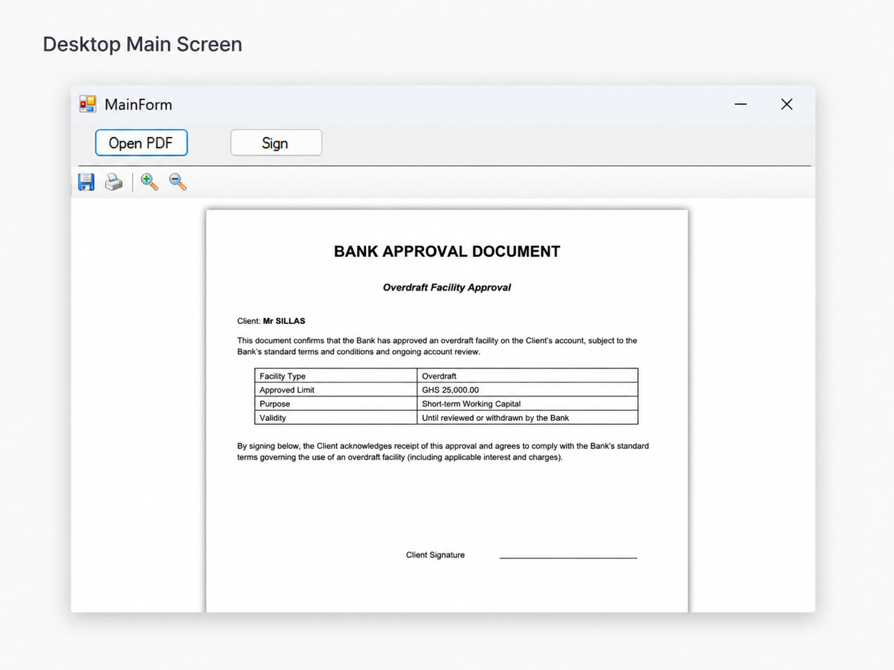
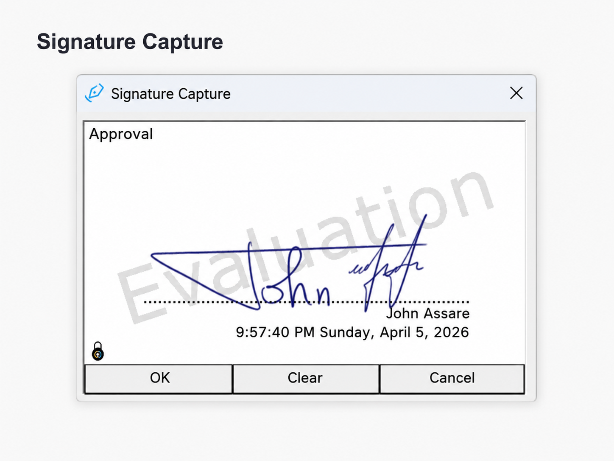
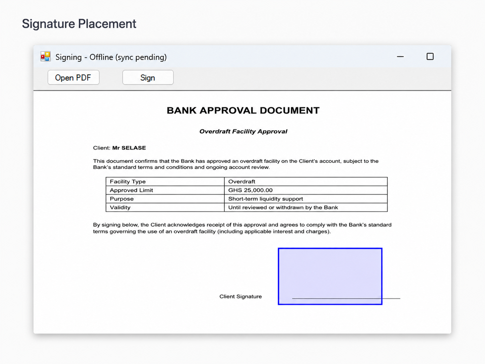
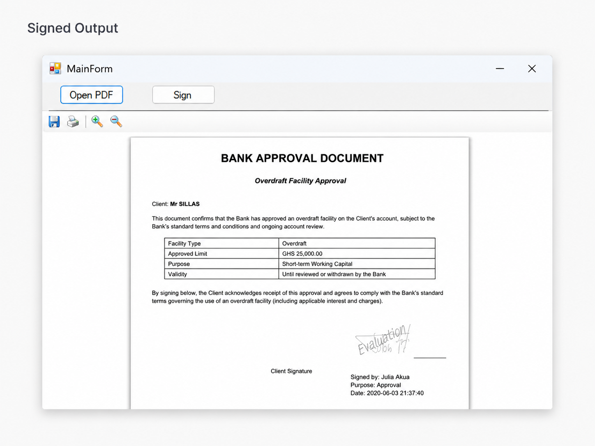
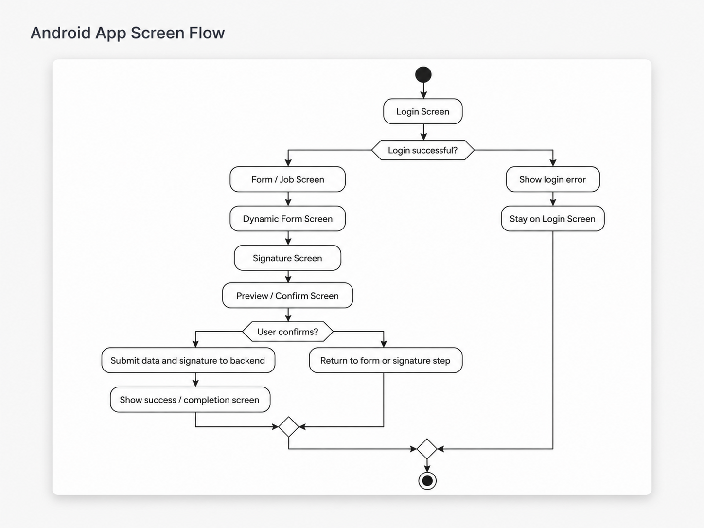

# Wacom Signing Platform Demo

A public portfolio case study for a Wacom-based Android and desktop digital signing platform.

This project is designed to solve a real business workflow problem: replacing manual paper signing with a secure digital signing process that can connect to backend systems, business applications, and document approval workflows.

> Note: This repository is a public case study. The private source code, API keys, database files, certificates, internal URLs, and production files are not included.

---

## Project Overview

The platform supports a digital signing workflow where a user can open a document, capture a handwritten signature using a Wacom device, place the signature on a PDF, and generate a signed document output.

The Android app flow is designed for mobile and field signing scenarios. It includes login, form/job selection, dynamic form rendering, signature capture, preview, and final submission to an API.

---

## My Role

**Android Kotlin & Software Developer**

I worked on the software flow, UI planning, signing workflow, PDF/document process, Wacom device integration, and backend-connected architecture.

---

## Key Features

- Desktop PDF signing workflow
- Wacom signature capture
- Signature placement on PDF documents
- Signed document output generation
- Android signing app flow design
- Login and form/job selection flow
- Dynamic form rendering concept
- REST API-based backend communication
- Backend-connected document workflow
- Business process automation for signing scenarios

---

## Tech Stack

### Android

- Kotlin
- Jetpack Compose
- Android Studio
- Gradle
- MVVM architecture
- Retrofit
- Room
- Hilt
- REST API integration

### Desktop / Backend

- C#
- .NET
- WinForms
- ASP.NET Core Web API
- Entity Framework
- SQLite / SQL Server
- PDF processing
- Wacom SDK integration

### Workflow / Tools

- Git
- GitHub
- API design
- Database-backed workflow design
- System architecture planning
- Debugging and testing

---

## Desktop Signing Flow

The desktop application allows a user to open a PDF document, capture a signature, place the signature on the document, and generate a signed output.

### Desktop Main Screen

### Signature Capture

### Signature Placement

### Signed Output

---

## Android App Flow

The Android app flow is planned for mobile signing and field data collection. The app starts with login, moves to form/job selection, renders dynamic form data, captures the signature, previews the result, and submits the final data to the backend API.

---

## Problem Solved

Many organizations still depend on manual paper signing, physical document handling, and disconnected approval processes.

This project shows how a digital signing system can improve that workflow by:

- reducing manual paper handling
- capturing signatures digitally
- connecting signing actions to backend systems
- generating signed document output
- supporting future mobile and field signing scenarios
- creating a foundation for audit tracking and business integration

---

## Future Improvements

Planned improvements include:

- Full Android app implementation
- Backend job management API
- User authentication and role-based access
- Offline signing support
- Audit trail and signing history
- ERP or business system integration
- Improved PDF signing and verification workflow
- Cloud or enterprise deployment support

---

## Repository Note

This repository is not the full production system.

It is a public portfolio summary created to show the project idea, workflow, screenshots, architecture direction, and technologies used.

Private source code, client data, certificates, database files, API secrets, and production configuration files are intentionally excluded.
